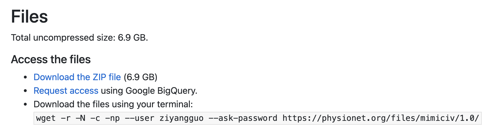

# AI Clinician - MIMIC-IV Python Replication

This repository reproduces the [AI Clinician](https://github.com/matthieukomorowski/AI_Clinician), a reinforcement learning algorithm for sepsis treatment prediction developed by Mathieu Komorowski et al. and published in [_Nature_](https://www.nature.com/articles/s41591-018-0213-5). The new code base has been translated to Python and adapted for MIMIC-IV by [Ziyang Guo](https://github.com/Guoziyang27), and refined and refactored by [Venkat Sivaraman](https://github.com/venkatesh-sivaraman).

## Running the Pipeline

The pipeline is split into three steps: data extraction, preprocessing, and modeling. Each step consists of one or more Python scripts, which can either be run individually (for greater flexibility) or through the single `run.sh` shell script.

### Prerequisites

**Package Requirements.** Create a conda or venv environment and activate it, if desired. Then install the package and its dependencies:

```
pip install -e .
```

**MIMIC Access.** Create a Google Cloud account that you will use to access the MIMIC-IV data through BigQuery. Get access to MIMIC-IV by going to [PhysioNet](https://physionet.org/content/mimiciv/1.0/). Then select "Request access using Google BigQuery".



Setting up your client credentials if needed (see [this guide](https://cloud.google.com/bigquery/docs/authentication/end-user-installed) for using client credential to authenticate the API).


You may want to save the client secret JSON file into this directory, and note the file path for later.

You should create a GCP "project", which serves as a container for the queries and analyses you perform. To do so, go to the project selector (to the left of the search bar in the GCP console) and click New Project. Save the name of this project, as you will need it in the data extraction step.

### Simple Run Instructions

Extract data into `data/` within this directory:

```
python run.sh extract <PATH_TO_CLIENT_SECRET> <GCP_PROJECT_NAME>
```

Preprocess data, filter sepsis cohort, and generate full MIMIC dataset into a directory `data/<DATA_NAME>`:

```
python run.sh preprocess <DATA_NAME>
```

Train models from data directory `data/<DATA_NAME>` into models directory `data/<MODELS_NAME>`:

```
python run.sh model <DATA_NAME> <MODELS_NAME>
```
